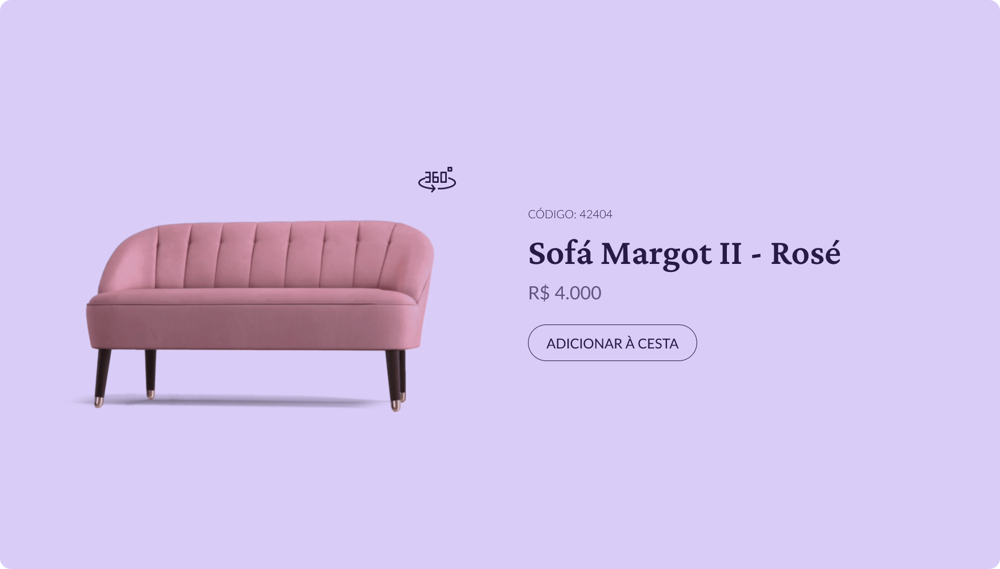

<h1 align="center">Product Card</h1>

  <h3>
    <a href="https://eliel-souza.github.io/desafio02-bora-codar/">
      Site
    </a>
  </h3>

&nbsp;

&nbsp;

## Sobre o Projeto

O desafio é criar o Product Card e deixá-lo o mais próximo possível do design.
Você pode usar qualquer ferramenta que desejar para ajudá-lo a concluir o desafio.
Abaixo temos algumas definições que precisam ser atendidas.

Os usuários devem ser capazes de:

**- Ao clicar no botão 360°, a página deve exibir uma das duas opções:**
  1. Trocar a imagem estática por um gif
  2. Trocar a imagem estática por um modelo 3D, que seja navegável ao arrastar o mouse

**- Ao clicar no botão X, a página deve voltar a exibir a imagem estática.**

## Construído com

- HTML5
- BEM
- CSS
- Flexbox
- Grid
- Mobile-first
- Javascript